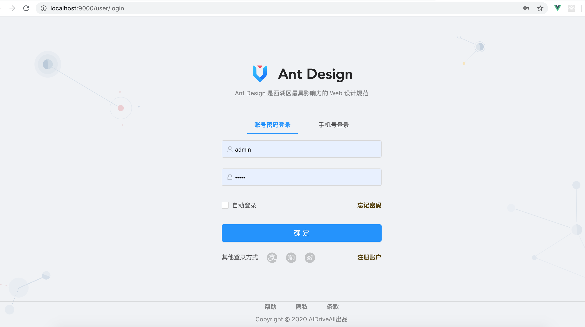
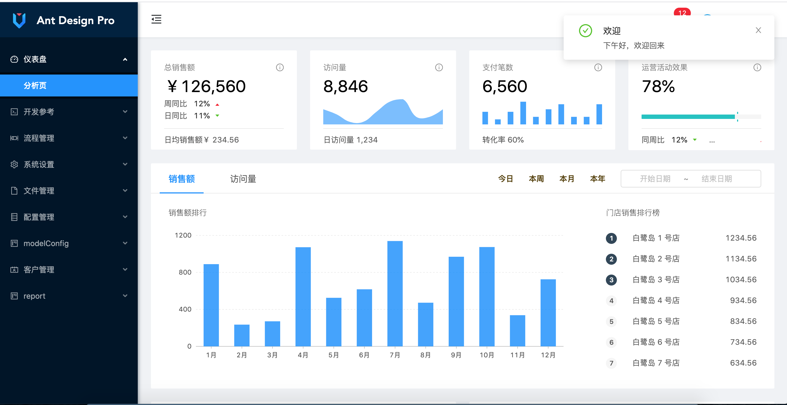
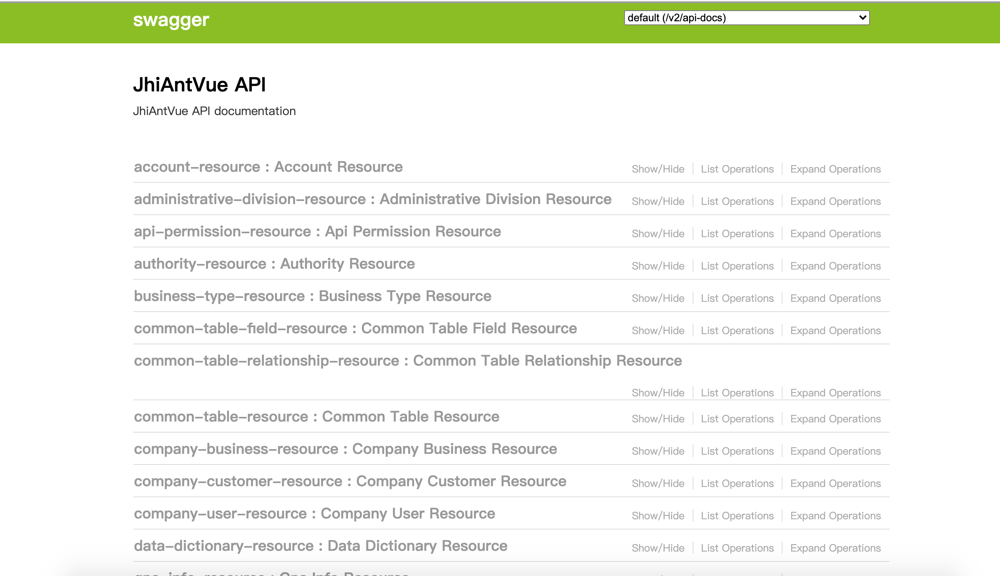
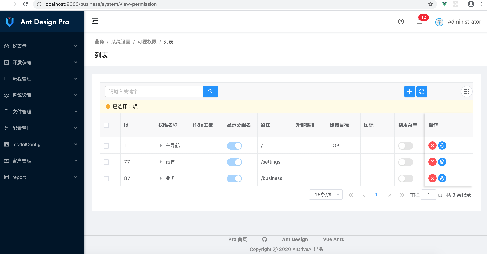
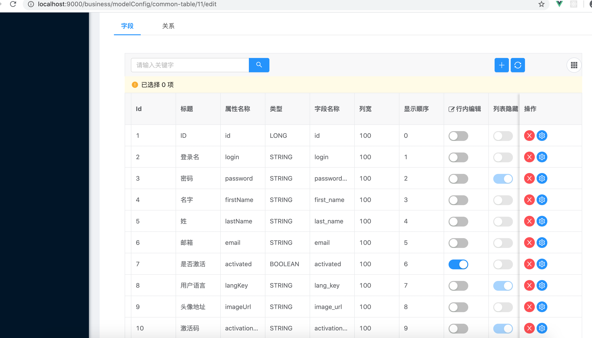
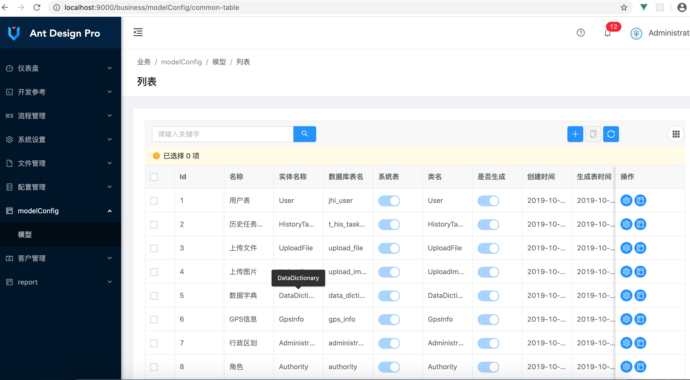
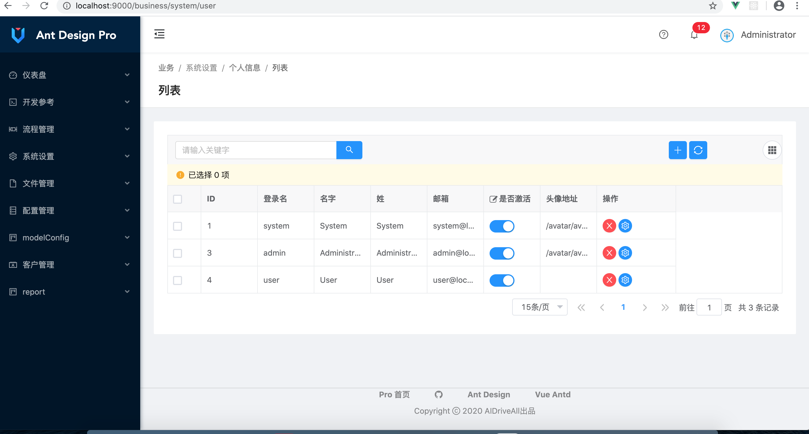
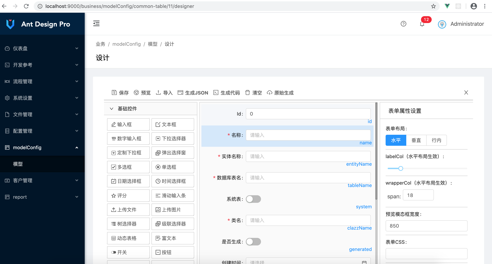
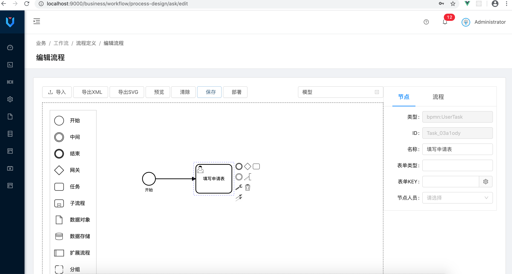
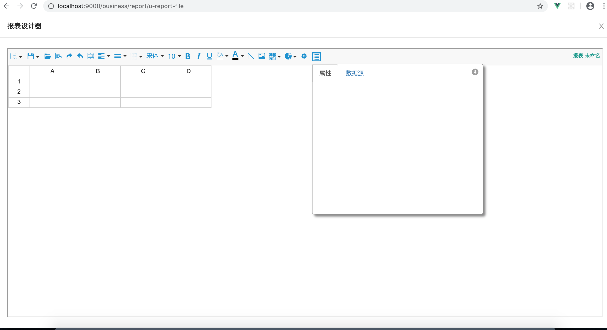

# JhiAntVue

基于 JHipster 6.7.1 的自定义生成器生成的项目, Jhipster 官方文档 [https://www.jhipster.tech/documentation-archive/v6.7.1](https://www.jhipster.tech/documentation-archive/v6.7.1).

## Development

在生成此项目之前，必须在计算机上安装和配置以下依赖项：

1.  [Node.js][]:
    注意先创建 MySQL 数据库，编码：utf8mb4，数据库名：JhiAntVue
    数据库用户名和密码在 application-dev.yml 中修改。默认用户名：root，密码为空
    安装依赖，在项目目录下运行：

        npm install

        ./mvnw   启动后端
        npm start 启动前端

## 上线打包

### 打包为 Jar 包

要构建最终的 jar 并优化 JhiAntVue 应用程序以进行生产，请运行:

    ./mvnw -Pprod clean verify
     建议 mvn -Pprod package -Dmaven.test.skip=true

运行 jar 文件：

    java -jar target/*.jar

打开浏览器 [http://localhost:8080](http://localhost:8080).

用户名：admin，密码：admin
其他内容 [Using JHipster in production][]

### 打包为 War 包

要将您的应用程序打包为战争以便将其部署到应用程序服务器，请运行:

    ./mvnw -Pprod,war clean verify
     建议 mvn -Pprod,war package -Dmaven.test.skip=true

## 测试（不完整，仅有官方部分）

要启动应用程序的测试，请运行:

    ./mvnw verify

## 技术栈列表

### 后台系统（基本以 Jhipster 提供为主）

- spring-boot 2.2.4.RELEASE
- spring-boot-security 用户登录验证
- undertow web 容器
- mysql 优秀的开源数据库
- hikari 速度最快的数据库连接池
- spring-data-jpa
- liquibase
- uReport 报表
- flowable 流程引擎

### 前端系统（Vue）

- Vue 2.6.x
- Ant-Design-Vue 1.5.2
- vue-class-component
- vue-property-decorator
- vxe-table
- bpmn-js
- k-form-design

## 特别说明

因其他原因代码部分不含自定义的基于 Jhipster 的代码生成器。目前系统结构对官方代码生成器兼容性较差。
另感谢部分组件作者：k-form-design,vxe-table,jeecg-boot,uReport 等等。
微信交流群：

	

## 部分截图，演示后续再上吧。

### 1.登录

	

### 2.首页

	

### 3.API

	

### 4.菜单管理

	

### 5.列表配置

	

### 6.模型配置

	

### 7.用户列表

	

### 8.表单配置

	

### 9.流程设计

	

### 10.报表设计器

	

其他内容请浏览 Jhipster 官网。

[jhipster homepage and latest documentation]: https://www.jhipster.tech
[jhipster 6.7.1 archive]: https://www.jhipster.tech/documentation-archive/v6.7.1
[using jhipster in development]: https://www.jhipster.tech/documentation-archive/v6.7.1/development/
[using docker and docker-compose]: https://www.jhipster.tech/documentation-archive/v6.7.1/docker-compose
[using jhipster in production]: https://www.jhipster.tech/documentation-archive/v6.7.1/production/
[running tests page]: https://www.jhipster.tech/documentation-archive/v6.7.1/running-tests/
[code quality page]: https://www.jhipster.tech/documentation-archive/v6.7.1/code-quality/
[setting up continuous integration]: https://www.jhipster.tech/documentation-archive/v6.7.1/setting-up-ci/
[node.js]: https://nodejs.org/
[yarn]: https://yarnpkg.org/
[webpack]: https://webpack.github.io/
[angular cli]: https://cli.angular.io/
[browsersync]: https://www.browsersync.io/
[jest]: https://facebook.github.io/jest/
[jasmine]: https://jasmine.github.io/2.0/introduction.html
[protractor]: https://angular.github.io/protractor/
[leaflet]: https://leafletjs.com/
[definitelytyped]: https://definitelytyped.org/
[openapi-generator]: https://openapi-generator.tech
[swagger-editor]: https://editor.swagger.io
[doing api-first development]: https://www.jhipster.tech/documentation-archive/v6.7.1/doing-api-first-development/
